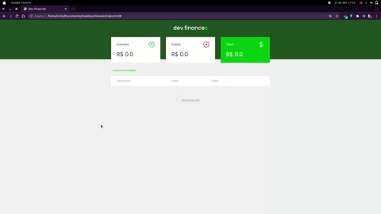

  
  
Aplicação de Controle Financeiro

# 💻 Sobre o Projeto
  
  
Dev finances é um Site de Controle financeiro, colocando a sua renda e os seus gastos mensais dentro da aplicação        você pode ter um controle maior da sua vida financeira.

  
Os usários poderão utilizar o site da seguinte forma:

  <ul>
    <li>Adicionando uma nova transação</li>
      <ol type="a">
        <li>Descrição (exemplo: Salário).</li>
        <li>Valor (exemplo: R$ 6000.00).</li>
        <li>Data (exemplo 09/11/1998).</li>
      </ol>
  <li>Excluindo uma transação</li>
  <li>Analisar o total de dinheiro em caixa</li>
  </ul>
  
### 🎥 Video da Aplicação

<h2>Observações</h2>
O projeto foi pautado na aplicação dev finances da Rocketseat.
 
Landind page foi feita seguindo o tutorial da rocket e toda a parte lógica do site é solução pessoal.
 

<h4> 
	🚧  dev.finance$ Em construção...  🚧
</h4>

### 🛠 Tecnologias

As seguintes ferramentas foram usadas na construção do projeto:

- [HTML](https://developer.mozilla.org/pt-BR/docs/Web/HTML)
- [CSS](https://developer.mozilla.org/pt-BR/docs/Web/CSS)
- [JavaScript](https://developer.mozilla.org/pt-BR/docs/Web/JavaScript)
